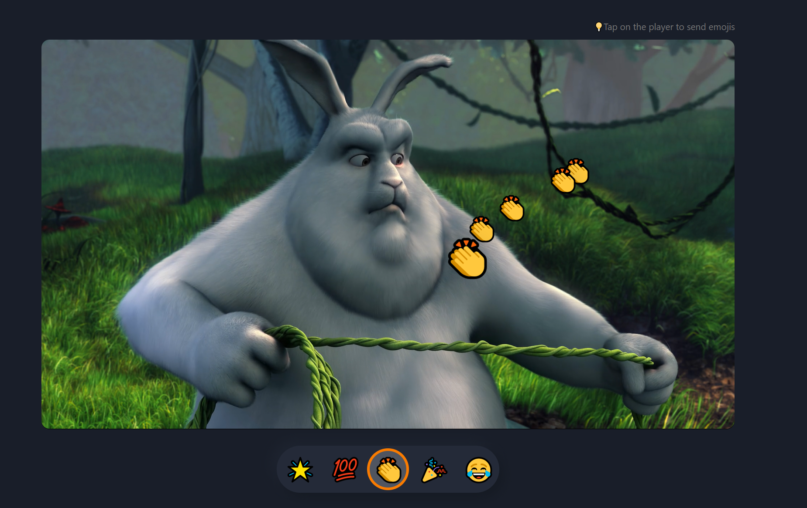

# Amazon Social Reactions Web demo

A demo web application for demonstrating how you can use Amazon IVS in conjunction with Social Reactions to react with emojis in a live stream.

**This project is intended for education purposes only and not for production usage.**

This is a serverless web application, leveraging [Amazon IVS](https://aws.amazon.com/ivs/), [Amazon ECS](https://aws.amazon.com/ecs/), [Amazon API Gateway](https://aws.amazon.com/api-gateway/), [AWS Lambda](https://aws.amazon.com/lambda/), [Amazon DynamoDB](https://aws.amazon.com/dynamodb), [Amazon S3](https://aws.amazon.com/s3/), [Amazon CloudFront](https://aws.amazon.com/cloudfront/), [Amazon SNS](https://docs.aws.amazon.com/sns/latest/dg/welcome.html) and [Amazon SQS](https://docs.aws.amazon.com/sqs/index.html). The web user interface is a single page application built using JavaScript, HTML and CSS. The demo showcases how you can send reactions in a live stream. As well as you can see the reactions of other users in real-time. 

 

## Getting Started

⚠️ **IMPORTANT NOTE:** *Deploying this demo application in your AWS account will create and consume AWS resources, which will cost money.*

To get the demo running in your own AWS account, follow these instructions.

1. If you do not have an AWS account, please see [How do I create and activate a new Amazon Web Services account?](https://aws.amazon.com/premiumsupport/knowledge-center/create-and-activate-aws-account/)
2. Log into the [AWS console](https://console.aws.amazon.com/) if you are not already. Note: If you are logged in as an IAM user, ensure your account has permissions to create and manage the necessary resources and components for this application.
3. Follow the instructions for deploying to AWS.

> **Note:** 
Although the demo can be deployed without having previously created an ([IVS channel](https://aws.amazon.com/)), it is necessary to have at least one to test the demo. It can be created before or after deploying.

### Deploying to AWS
* This demo is comprised of two parts: `serverless` (the demo backend) and `web-ui` (the demo frontend).
* To use this demo, follow the [deployment instructions](./deployment/README.md).

 

## Architecture

 

## Known issues and limitations
* The application was written for demonstration purposes and not for production use.
* Currently only tested in **us-west-2 (Oregon)** and **us-east-1 (N. Virginia)** regions. Additional regions may be supported depending on service availability.
  
 

## Estimated costs
To be defined

 

## About Amazon IVS
* Amazon Interactive Video Service (Amazon IVS) is a managed live streaming solution that is quick and easy to set up, and ideal for creating interactive video experiences. [Learn more](https://aws.amazon.com/ivs/).
* [Amazon IVS docs](https://docs.aws.amazon.com/ivs/)
* [User Guide](https://docs.aws.amazon.com/ivs/latest/userguide/)
* [API Reference](https://docs.aws.amazon.com/ivs/latest/APIReference/)
* [Learn more about Amazon IVS on IVS.rocks](https://ivs.rocks/)
* [View more demos like this](https://ivs.rocks/examples)
